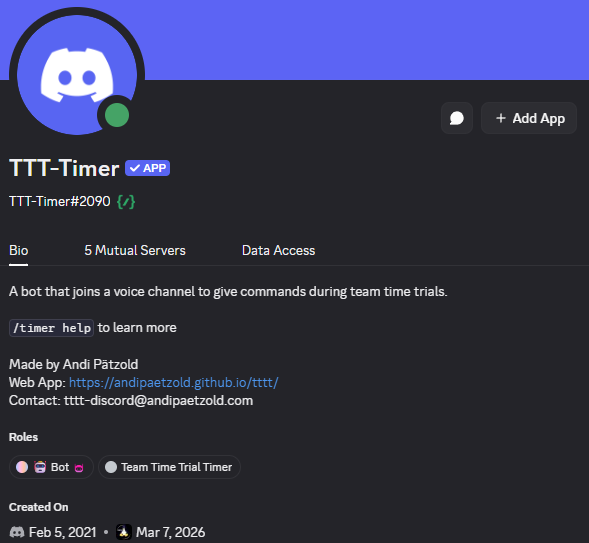
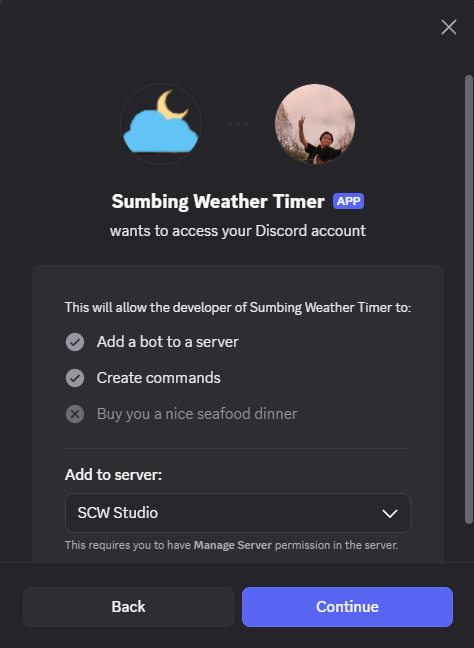
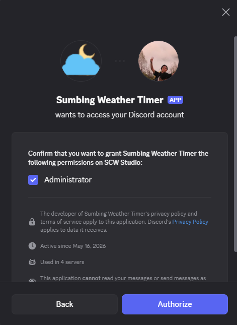
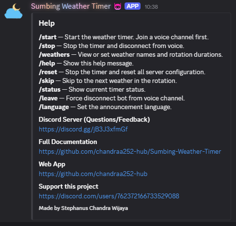
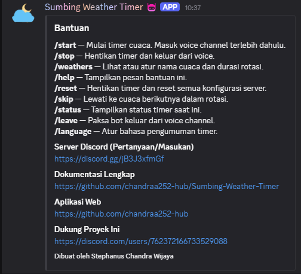
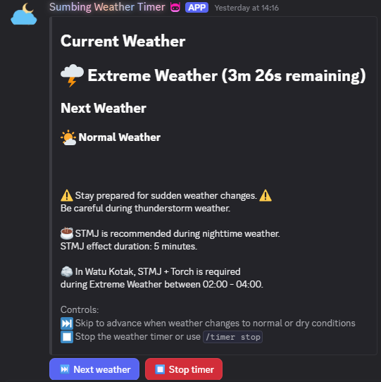
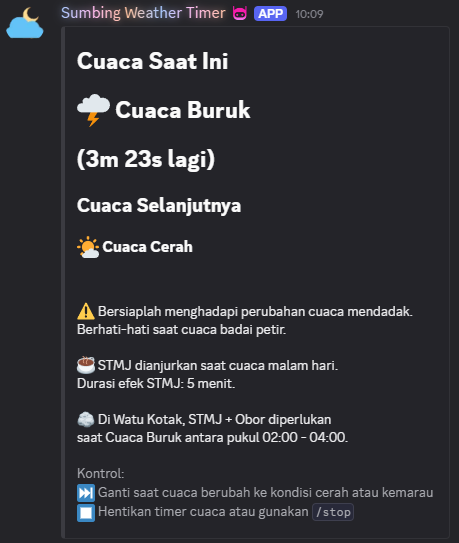

># Sumbing Weather Discord Bot

This Discord bot was built to provide weather information and voice-based instructions inside a Discord voice channel. It helps users by giving automated announcements and real-time updates.

The bot joins a Discord call and delivers voice commands or information to everyone in the channel.

This project is a customized version of the original bot, adapted for specific use cases such as weather monitoring and automated voice notifications.
This project is based on the original TTT-Timer Discord Bot:
https://github.com/andipaetzold/tttt-discord



## Requirements

- Node.js `22.12+` (`22.22.2` is pinned in `.nvmrc`)
- Redis 7 or newer with persistent storage enabled
- A Discord bot application and token
- PM2 for an always-running local or VPS installation

## Installation

### Run locally with PM2

This is the same process used on a VPS. Redis must be running before the bot:

```bash
cp .env.example .env
# Edit .env and set DISCORD_TOKEN and REDIS_URL
npm ci
npm run build
npm install --global pm2
pm2 start ecosystem.config.cjs --update-env
pm2 save
pm2 startup
```

Run the exact command printed by `pm2 startup` to enable automatic startup after
the machine reboots. Useful PM2 commands:

```bash
pm2 status
pm2 logs sumbing-weather-bot
pm2 restart sumbing-weather-bot --update-env
pm2 stop sumbing-weather-bot
```

For a complete Ubuntu/Debian VPS setup, use the bundled script:

```bash
bash deploy/setup-vps.sh
```

The script validates Node.js and `.env`, installs the locked dependencies,
builds the TypeScript source, prunes development packages, and starts PM2.

### Run with Docker Compose

Docker Compose includes a persistent Redis volume:

```bash
cp .env.example .env
# Edit .env and set DISCORD_TOKEN
docker compose up -d --build
docker compose logs -f bot
```

Stop the stack without deleting the Redis volume:

```bash
docker compose down
```

The `redis-data` volume contains the global timer configuration. Do not use
`docker compose down -v` unless you intentionally want to erase it.

### Downloaded ZIP package

The release ZIP contains the compiled bot, source, deployment scripts, sounds,
and configuration templates. On a VPS or local machine:

```bash
unzip sumbing-weather-bot-vps-pm2.zip
cd sumbing-weather-bot-vps-pm2
cp .env.example .env
# Edit .env
bash deploy/setup-vps.sh
```

The ZIP never contains `.env`, Discord credentials, `node_modules`, Redis data,
or runtime logs.

### Discord installation

Click here to invite the bot to your server:

https://discord.com/oauth2/authorize?client_id=1505002488409882684

You will be asked to grant multiple permissions:





| Permission      | Description                                                                 |
| --------------- | --------------------------------------------------------------------------- |
| Send Messages   | Allows the bot to send messages to a text channels                          |
| Manage Messages | Allows the bot to update messages for interactive behavior                  |
| Connect         | Allows the bot to join a voice channel                                      |
| Speak           | Allows the bot to send audio / voice to a voice channel                     |
                                                                                           

## VPS Deployment

For a production VPS, use the bundled PM2 setup or Docker Compose instructions:

```text
deploy/README.md
```

The PM2 path uses system Redis and the Docker path includes a persistent Redis
container. Both paths load secrets from `.env`. Full VPS details are in
[`deploy/README.md`](./deploy/README.md).

## Usage

- All commands are case insensitive.
- There is only one configuration per server. Changes made in any channel will affect the same configuration.

## Global timer persistence

Global timer settings are stored in Redis under the bot-specific
`global-timer:<BOT_ID>` key. The saved state includes:

- the reference time created by `/weather start-global`
- the signed corrections from `/weather adjust-global offset:<seconds>`
- the cycle duration from `/weather adjust-global duration:<seconds>`
- running/stopped state and scheduled stop time

Restarting the bot or hosting machine does not reset these values. Redis must
use persistent storage (`appendonly yes`, `appendfsync everysec`) and its data
directory or Docker volume must not be deleted. A default state is created only
when the global timer key does not exist.

### Documentation Syntax

| Syntax                  | Meaning                                                                 |
| ----------------------- | ----------------------------------------------------------------------- |
| `<weather>` or `<time>` | Required parameter                                                     |
| `[<weather>]`           | Optional parameter                                                     |
| `@user`                 | Represents a Discord mention                                           |


### Commands

#### `/help`





Shows a list of available commands, project links, and developer information.

Example output:

```bash
/weather start — Start the weather timer. Join a voice channel first.
/weather stop — Stop the timer; the bot stays in voice.
/help — Show this help message.
/leave — Force disconnect bot from voice channel.
/language — Set the announcement language.

Discord Server (Questions/Feedback)
https://discord.gg/jB3J3xfmGf

Full Documentation
https://github.com/chandraa252-hub/Sumbing-Weather-Timer

Web App
https://github.com/chandraa252-hub

Support this project
https://discord.com/users/762372166733529088

Made by Stephanus Chandra Wijaya
```

---

#### `/weather start`



Starts the weather timer. The bot joins your current voice channel or uses the previous one and stays connected until `/leave`.

---

#### `/weather stop`

Stops the timer but keeps the bot in the voice channel.

---

#### `/weather start-global [time]`

Starts the shared weather cycle for all subscribed servers. The optional `time` uses WITA in `HH.MM.SS` format and defaults to starting immediately.

Only configured global admins can use this command.

---

#### `/weather stop-global [time]`

Stops the shared weather cycle. With an optional WITA time, the stop is scheduled for that time; without it, the cycle stops immediately.

Only configured global admins can use this command.

---

#### `/weather adjust-global [time] [offset] [duration]`

Adjusts the global cycle reference time and duration. The optional `time` sets an absolute WITA time. The optional `offset` corrects the previously saved reference time by a number of seconds: positive values move it later and negative values move it earlier. The optional `duration` sets the duration of one cycle in seconds and can contain decimals. Use either `time` or `offset`; `duration` can be used with either one.

Only configured global admins can use this command.

Examples:
```bash
/weather adjust-global time:22.30.00
/weather adjust-global offset:-10
/weather adjust-global duration:689.7
/weather adjust-global offset:-10 duration:689.7
```

---

#### `/admin-message message`

Sends an admin message to every guild where the bot is installed. The bot uses
the saved timer status channel when available, then falls back to the guild's
system channel or the first text channel where it can send messages. Only
configured global admins can use this command. Guilds without an accessible
text channel are reported as failed while other guilds still receive the
message.

Example:
```bash
/admin-message message:Maintenance selesai, bot akan segera aktif kembali.
```

---

#### `/leave`

Force disconnects the bot from the current voice channel.

This command is the only command that intentionally disconnects the bot from the voice channel.

---

#### `/language [<language>]`

Shows or changes the current announcement language.

Available languages:
- `en-gb` — English (British)
- `en-us` — English (US)
- `id` — Indonesian

Changing the language automatically updates:
- Voice announcements (TTS)
- Spoken accent and pronunciation
- Help messages
- Status messages
- Weather names and labels

For example, selecting `id` changes all announcements into Indonesian and uses Indonesian voice pronunciation for TTS audio playback.

Example:
```bash
/language id
```

Example `/weather start` message in Indonesian:



```bash
Cuaca Saat Ini
🌩️ Cuaca Buruk
(3m 23s lagi)

Cuaca Buruk Berikutnya
⠀

⚠️ Bersiaplah menghadapi perubahan cuaca mendadak.
Berhati-hati saat cuaca badai petir.
⠀
☕ STMJ dianjurkan saat cuaca malam hari.
Durasi efek STMJ: 5 menit.
⠀
🪨 Di Watu Kotak, STMJ + Obor diperlukan
saat Cuaca Buruk antara pukul 02:00 - 05:59.

Kontrol:
⏭️ Ganti saat cuaca buruk dimulai
⏹️ Hentikan timer cuaca atau gunakan /weather stop
```

---


## Status Message

When starting the timer using `/weather start`, a message is sent to the current channel. This message automatically updates and shows the current weather, the next-weather label, and additional information or warnings.

Example:

```text
Current Weather
🌩️ Extreme Weather (7m 14s remaining)

Next Extreme Weather


⚠️ Stay prepared for sudden weather changes. ⚠️
Be careful during thunderstorm weather.

☕ STMJ is recommended during nighttime weather.
STMJ effect duration: 5 minutes.

🪨 In Watu Kotak, STMJ + Torch is required
during Extreme Weather between 02:00 - 05:59.

Controls:
⏭️ Skip when extreme weather starts
⏹️ Stop the weather timer or use /weather stop
```

The message will continuously update based on the current timer and weather rotation.

The bot automatically reacts with control emojis to this message. These can be used as buttons to control the bot without typing commands.

| Emoji | Equivalent Slash Command | Note                                      |
| ----- | ------------------------ | ----------------------------------------- |
| ⏭️    | `/weather skip`    | Skip to the next weather in the rotation  |
| ⏹️    | `/weather stop`    | Stop the timer; the bot stays in voice    |


## Voice Commands

The bot automatically gives voice notifications 5/10/15/30 seconds and 1/3/5 minutes before a weather change or before the timer starts.

A voice notification is also played when:
- the timer starts
- switching to the next weather
- skipping the current weather

## Parallel Timers

Discord does not allow a bot to join multiple voice channels at the same time.

To run multiple timers in parallel on the same server, you can use more than one bot instance.

| Bot              | Description                         | Install Link                                                                 |
| ---------------- | ----------------------------------- | ---------------------------------------------------------------------------- |
| Sumbing Timer    | Main weather timer bot              | https://discord.com/oauth2/authorize?client_id=1505002488409882684          |
| TTT-Timer (Andi) | Backup timer (alternative instance) | https://discord.com/api/oauth2/authorize?client_id=806979974594560060&permissions=3155968&scope=bot+applications.commands |

The backup bot behaves similarly but runs independently with its own configuration.

---

## Data Privacy

This bot does not store or log personal data outside of what is required for
its functionality. Server configuration, timer state, and status-channel
references are stored in Redis so the bot can recover after a restart. They
remain available while the Redis data is retained; remove the relevant Redis
keys or volume when you want to erase the bot state.

The source code of this project is publicly available on GitHub.

---

## Troubleshooting

| Problem                                      | Possible Solution                                                                 |
| -------------------------------------------- | --------------------------------------------------------------------------------- |
| Slash commands are not visible               | Try reinviting the bot using the installation link                               |
| The bot does not respond to commands         | Make sure the bot has permission to read and send messages in the channel        |
| The timer does not start                     | Ensure you are connected to a voice channel before running `/weather start`       |
| The skip button does not work                | Make sure the bot has permission to manage messages and reactions                |
| The bot does not join voice channel          | Check voice channel permissions (Connect & Speak)
| Global timer returned to defaults            | Check that Redis persistence is enabled and that its data directory or Docker volume was not deleted |
| `/admin-message` missed a guild              | Check that the bot can View Channel and Send Messages in at least one text channel |

## Recent Beta Development Updates

- Added new commands and fixed voice channel disconnection issues
- Updated commands and language options for better user experience
- Added Indonesian language support for bot announcements and commands
- Fixed error when starting the bot via PM2 on Windows
- Updated timer commands and bot configuration settings
- Updated countdown timer to refresh every ten seconds
- Saved timer progress at the end of the loop
- Added project overview and setup instructions to README

---


## Need help?

Join the Discord server for questions, feedback, or support:

https://discord.gg/jB3J3xfmGf

Full Documentation:
https://github.com/chandraa252-hub/Sumbing-Weather-Timer

---

## Contact

**Stephanus Chandra Wijaya**

GitHub:  
https://github.com/chandraa252-hub  

Discord:  
https://discord.com/users/762372166733529088
